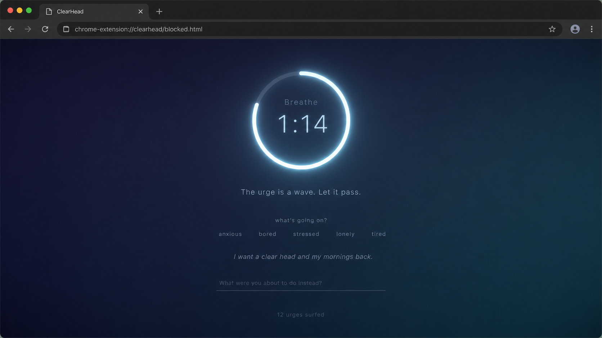

# ClearHead — Design Document

**Date:** 2026-06-12
**Status:** Approved design, pre-implementation
**Type:** Local Chrome extension (Manifest V3, unpacked)

---

## 1. Purpose

ClearHead is a **local-only Chrome extension** that blocks pornography sites and,
instead of showing a generic "can't reach this page" error, redirects the tab to a
calm **intervention page** built on evidence-based CBT/ACT techniques (breathing,
urge-surfing, affect labeling, values, relapse-prevention framing).

It is built and run by the user as an **unpacked extension** — never published to the
Chrome Web Store. This is a deliberate security choice: extension supply-chain attacks
(ownership changes, malicious auto-updates, over-broad permissions) are a real risk, and
a self-authored extension with no auto-update and minimal permissions sidesteps all of it.

### Design philosophy
- **Quality of intervention over brute force.** The block is the moment of leverage; the
  page turns it into a replacement routine rather than just a wall.
- **Calm, never shaming.** Tone throughout is supportive. A slip is not a relapse.
- **Self-binding with friction, not an instant escape hatch.** Protection can be relaxed,
  but only deliberately and after a cooldown — never in the 90-second weak moment.

---

## 2. Goals & non-goals

### Goals
- Block a curated list of common adult domains, plus user-added domains.
- Redirect blocked navigations to a local, calm intervention page.
- Make *removing* protection require friction (cooldown + type-to-confirm).
- Track lightweight local stats (encounters, urges surfed, trigger patterns).
- Use the **absolute minimum** Chrome permissions, so the extension is structurally
  incapable of seeing browsing history or exfiltrating data.

### Non-goals (YAGNI)
- **No "let me through" / bypass button.** The only path to a blocked site is removing
  the domain in settings, through the cooldown. (Decided: a per-page bypass contradicts
  the tool's purpose.)
- **No cross-device sync** in v1 (architecture leaves the door open — see §6).
- **No keyword/search-term blocking** in v1 (domain-based blocking covers the actual
  sites; keyword matching would require browsing-visibility permissions we refuse to take).
- **No accounts, no network calls, no analytics, no hosted backend.** Nothing is hosted.

---

## 3. Architecture

Manifest V3 Chrome extension, loaded unpacked, running entirely locally.

### Blocking mechanism — `declarativeNetRequest` (DNR)
Blocking is done **100% through Chrome's `declarativeNetRequest` API**. The extension
declares rules ("these domains → redirect to my intervention page") and **Chrome itself**
performs the match and redirect. The extension's own code is never invoked on a blocked
navigation — it literally cannot see the user's browsing.

Approaches considered and rejected:
- **`webRequest` blocking listener** — deprecated in MV3 for regular extensions. Not viable.
- **`tabs` / `webNavigation` redirect in JS** — would require broad host + `tabs`
  permissions (i.e. visibility into every URL visited), the exact thing we're avoiding.
  Only advantage was keyword matching, which is a non-goal.

### Permissions (the privacy story)
```
permissions: ["declarativeNetRequest", "storage"]
```
**No `tabs`, no host permissions, no network access.** With this profile the extension
has nothing to steal and nowhere to send it — even in a hypothetical compromise. This
minimal footprint is the whole reason for building it ourselves, and is documented in the
README.


### Flow, end to end
1. User navigates to a blocked domain.
2. Chrome's DNR engine matches a rule and **redirects that tab** to the local
   `blocked.html` (a `chrome-extension://…` page packaged in the extension).
3. `blocked.html` loads and sends **one** runtime message to the background service
   worker to increment an "encounters" stat. This message is our *only* signal that a
   block happened — we never watch tabs.

### Known limitation (stated honestly)
No extension can prevent the user from going to `chrome://extensions` and toggling the
extension off — Chrome reserves that and our code cannot block it. "Self-binding friction"
therefore applies only to the paths **we** control: removing domains / disabling blocking
from our own settings page. The `chrome://extensions` nuclear option always exists. In
practice, friction on the in-extension paths is what catches the impulsive moment.

---

## 4. Storage — single source of truth

There are two things that could each *claim* to hold "the blocklist": our own
`chrome.storage`, and the DNR dynamic-rule table (which Chrome also persists). To avoid
drift bugs, we deliberately pick **one source of truth** and treat the other as derived.

```
STATIC      (in the repo, shipped):   curated domains → rules/curated.json
CANONICAL   (chrome.storage.local):   userDomains, settings, stats, pendingUnlock
DERIVED     (rebuilt from canonical): DNR dynamic rules
                                      ↑ reconciled on install / startup / change
```

- **Curated domains** are **static** — generated into `rules/curated.json` from
  `data/curated-domains.js`, version-controlled, shipped with the code. They never change
  at runtime.
- **User-added domains** live in `chrome.storage.local` and are **canonical**.
- **DNR dynamic rules** are a **projection** of the canonical user domains. On install, on
  browser startup, and on every add/remove, the background worker **reconciles**: read
  `userDomains` → rebuild dynamic rules to match (idempotent remove-then-add). Storage
  always wins.

### Why `local` (not `sync` / `session`)
- `storage.session` — wiped on browser close. Wrong (we need persistence).
- `storage.sync` — auto-syncs across devices but needs Chrome sign-in, has a small quota,
  and puts the list on Google's servers. Rejected for a privacy-first, offline-first v1.
- `storage.local` — persists locally, survives restarts, no account, offline, generous
  quota. **Chosen.**

### Storage access is wrapped
All storage access goes through a small `storage.js` module (`getDomains()`,
`addDomain()`, `getSettings()`, `getStats()`, …) rather than scattering
`chrome.storage.local` calls. This isolates the dependency, makes it unit-testable with a
fake, and means a future move to `sync` is a one-module change. (Don't build sync now —
just don't wall it off.)

### Schema (`chrome.storage.local`)
```js
userDomains:   ["example.com", ...]
settings:      { surfSeconds: 90, breathPattern: "box", whyStatement: "" }
stats:         { encounters, surfsCompleted, proceeds, triggers: { anxious: n, ... } }
pendingUnlock: { type, payload, unlockAt } | null
```

---

## 5. Surfaces

### 5.1 Block / intervention page (`blocked.html`)

A local, full-screen, **single-focal-point** page. Calm, premium, never shaming.
Design driven by the `refactoring-ui` principles: one hero element, generous whitespace,
everything else de-emphasized, smooth gradient background (no photographic noise).



**Layout (top → bottom):**
- **Hero (the only high-contrast element):** a glowing circular **breathing ring that
  doubles as the urge-surf countdown** — breath cue inside it ("Breathe"), time remaining
  ("1:14"). Merging breath + timer into one element keeps the screen quiet.
- **Reframe line** (muted, secondary): "The urge is a wave. Let it pass."
- **Trigger check** (small, de-emphasized): "what's going on?" + a compact row of chips
  — anxious / bored / stressed / lonely / tired. Tapping logs the trigger locally.
- **Your why** (muted, secondary): the user's values statement.
- **Next action** (minimal thin-underline input): "What were you about to do instead?"
- **Footer** (tertiary, tiny): "12 urges surfed."
- **No button.** The user closes the tab or navigates away themselves. There is no bypass
  and no exit control — the page simply *is* the calm screen.

**Evidence-based mapping (each element is a validated component, not decoration):**
| Element | CBT/ACT component |
|---|---|
| Breathing ring | mindfulness / emotion regulation |
| Trigger chips | affect labeling / cognitive |
| Urge-surf countdown | cue/urge management (urges crest and fall) |
| Your why | ACT values / commitment |
| Next action | goal-setting |
| "A slip isn't a relapse" footer | relapse prevention |

### 5.2 Settings / options page (`options.html`)

Clean, light, lots of whitespace, one teal accent reserved for primary actions; same
quieted treatment as the block page.


**Sections:**
- **Blocklist** — add a domain (friction-free); list of blocked domains each with Remove.
  **Removing** (or disabling blocking) triggers the **friction lockout**: a cooldown
  (default 5 min) + a type-to-confirm sentence. The change is stored as `pendingUnlock`
  with an `unlockAt` timestamp and only applied after the cooldown elapses.
- **Your Why** — editable values statement (shown on the block page).
- **Intervention** — urge-surf timer length (slider, default 90s) and breathing pattern
  (Box 4-4-4-4 vs 4-7-8).
- **Stats** — urges surfed, encounters, and a small bar chart of trigger types.

---

## 6. Typography & visual system

- **Typeface:** **Geist** (modern, clean, excellent at both the calm block page and the
  data-dense settings UI). One family, weight variation for hierarchy.
- **No italics** anywhere — emphasis comes from **weight and color** (per refactoring-ui:
  use hierarchy levers, not decoration).
- **Palette:** block page — dark indigo→teal gradient, single glowing teal-white ring;
  settings — near-white background, muted slate grays, one calm teal accent for primary
  actions only.
- **Spacing:** constrained scale (4/8/16/24/32px), generous whitespace, narrow centered
  column on the block page (~440px), constrained card column in settings (~620px).

---

## 7. Components / file structure

```
clearhead/
  manifest.json                 # MV3; permissions: declarativeNetRequest, storage
  rules/
    curated.json                # static DNR redirect ruleset (generated)
  data/
    curated-domains.js          # editable source list of curated domains
  src/
    background.js               # service worker: reconcile dynamic rules, stats, friction
    lib/
      storage.js                # wrapper over chrome.storage.local (canonical SoT)
      domains.js                # normalize/validate domain input (pure, unit-tested)
      friction.js               # cooldown / pendingUnlock logic (pure, unit-tested)
  pages/
    blocked.html / .css / .js   # intervention page
    options.html / .css / .js   # settings page
  scripts/
    build-rules.mjs             # compile data/curated-domains.js → rules/curated.json
  test/                         # node tests for pure logic + rule generator
  README.md                     # incl. the minimal-permissions privacy rationale
```

---

## 8. Data flow

- **Blocking:** Chrome matches a DNR rule → redirects the tab to `blocked.html`. Extension
  not involved (privacy).
- **Encounter stat:** `blocked.html` on load → one runtime message → background increments
  `stats.encounters`. Trigger chip / surf completion → further local stat writes.
- **Add domain:** options page → `addDomain()` writes `chrome.storage.local` → background
  reconciles dynamic DNR rules.
- **Remove domain / disable:** stored as `pendingUnlock` with `unlockAt` → applied only
  after the cooldown + type-to-confirm.

---

## 9. Error handling

- **Dynamic rule ID namespacing:** user dynamic rules use IDs ≥ 100000 to never collide
  with curated static rule IDs.
- **Storage read failures:** fall back to defaults; the page never crashes.
- **Service worker sleep:** DNR rules persist independently of the worker, so blocking
  survives; stat writes are awaited before the worker can suspend.
- **Malformed domain input:** validated/normalized (strip scheme/path, handle subdomains)
  before a rule is created.
- **Reconciliation is idempotent:** safe to run on every install/startup/change.

---

## 10. Testing

- **Node unit tests (no browser):**
  - `domains.js` — normalization/validation edge cases.
  - `friction.js` — cooldown / `unlockAt` logic.
  - `build-rules.mjs` — output is valid DNR rule JSON.
- **Manual checklist (load unpacked):**
  - Visit a curated domain → redirected to `blocked.html`.
  - Add a custom domain → it redirects.
  - Urge-surf timer cannot be skipped.
  - Removing a domain enforces the cooldown + type-to-confirm.
  - Stats increment correctly.

---

## 11. Security & privacy summary

- Minimal permissions (`declarativeNetRequest`, `storage`) — no tabs, no host, no network.
- No auto-update (unpacked), no third-party code, no hosted services, no telemetry.
- All data is local. The curated list ships in the repo; user data lives in
  `chrome.storage.local`.
- The README documents *why* the permission set is intentionally tiny.

---

## 12. Open questions / future

- **Cross-device sync** — deferred. The `storage.js` wrapper keeps it a one-module change
  if wanted later.
- **Accessibility tuning** — the block page's secondary text is intentionally low-contrast
  for calm; nudge contrast up to meet WCAG when building the real CSS.
- **Curated list maintenance** — how/whether to periodically expand `curated-domains.js`.

---

## 13. Approved mockups

- `docs/assets/architecture.png` — end-to-end architecture infographic
- `docs/assets/block-page.png` — intervention page (final)
- `docs/assets/settings-page.png` — settings page (final)

## 14. Evidence base (references)

- CBT for compulsive sexual behavior / problematic porn use — systematic review protocol:
  https://pmc.ncbi.nlm.nih.gov/articles/PMC8340575/
- Treatments for CSBD / problematic porn use — preregistered systematic review:
  https://pmc.ncbi.nlm.nih.gov/articles/PMC9872540/
- Web-based behavioral addiction treatments — content & effectiveness review:
  https://pubmed.ncbi.nlm.nih.gov/36083612/
- "Hands-off" web-based self-help RCT for problematic porn use:
  https://www.ncbi.nlm.nih.gov/pmc/articles/PMC8987418/
- ACT for problematic internet pornography use — randomized trial:
  https://www.researchgate.net/publication/294112945
