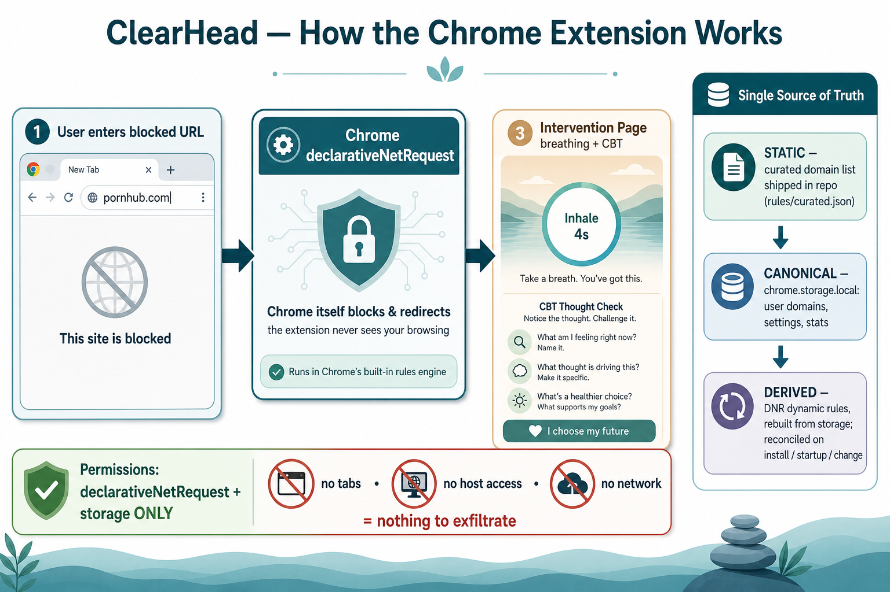
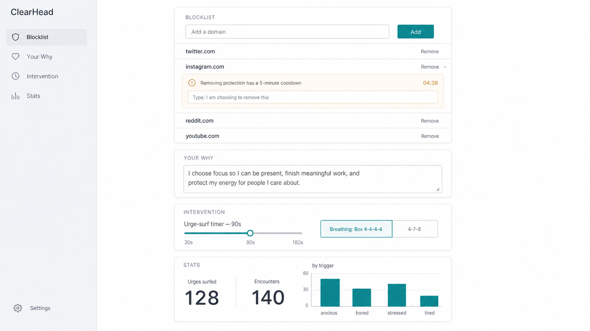

# ClearHead — Design Document

**Date:** 2026-06-12
**Status:** Approved design, pre-implementation
**Type:** Local Chrome extension (Manifest V3, unpacked)

---

## 1. Purpose

ClearHead is a **local-only Chrome extension** that blocks pornography sites and,
instead of showing a generic "can't reach this page" error, redirects the tab to a
calm **intervention page** built on evidence-based CBT/ACT techniques (breathing,
urge-surfing, affect labeling, values, relapse-prevention framing).

It is built and run by the user as an **unpacked extension** — never published to the
Chrome Web Store. This is a deliberate security choice: extension supply-chain attacks
(ownership changes, malicious auto-updates, over-broad permissions) are a real risk, and
a self-authored extension with no auto-update and minimal permissions sidesteps all of it.

### Design philosophy
- **Quality of intervention over brute force.** The block is the moment of leverage; the
  page turns it into a replacement routine rather than just a wall.
- **Calm, never shaming.** Tone throughout is supportive. A slip is not a relapse.
- **Self-binding with friction, not an instant escape hatch.** Protection can be relaxed,
  but only deliberately and after a cooldown — never in the 90-second weak moment.

---

## 2. Goals & non-goals

### Goals
- Block a curated list of common adult domains, plus user-added domains.
- Redirect blocked navigations to a local, calm intervention page.
- Make *removing* protection require friction (cooldown + type-to-confirm).
- Track lightweight local stats (encounters, urges surfed, trigger patterns).
- Use the **absolute minimum** Chrome permissions, so the extension is structurally
  incapable of seeing browsing history or exfiltrating data.

### Non-goals (YAGNI)
- **No "let me through" / bypass button.** The only path to a blocked site is removing
  the domain in settings, through the cooldown. (Decided: a per-page bypass contradicts
  the tool's purpose.)
- **No cross-device sync** in v1 (architecture leaves the door open — see §6).
- **No keyword/search-term blocking** in v1 (domain-based blocking covers the actual
  sites; keyword matching would require browsing-visibility permissions we refuse to take).
- **No accounts, no network calls, no analytics, no hosted backend.** Nothing is hosted.

---

## 3. Architecture

Manifest V3 Chrome extension, loaded unpacked, running entirely locally.

### Blocking mechanism — `declarativeNetRequest` (DNR)
Blocking is done **100% through Chrome's `declarativeNetRequest` API**. The extension
declares rules ("these domains → redirect to my intervention page") and **Chrome itself**
performs the match and redirect. The extension's own code is never invoked on a blocked
navigation.

Approaches considered and rejected:
- **`webRequest` blocking listener** — deprecated in MV3 for regular extensions. Not viable.
- **`tabs` / `webNavigation` redirect in JS** — would require broad host + `tabs`
  permissions (i.e. visibility into every URL visited). Only advantage was keyword
  matching, which is a non-goal.

### Permissions (the privacy story)
```
permissions:               ["declarativeNetRequest", "storage"]
host_permissions:          <generated from the blocklist only>   e.g. *://*.pornhub.com/*
optional_host_permissions: ["*://*/*"]   (requested per-domain when the user adds one)
```

**Important implementation finding (resolved):** a DNR `redirect` action only fires for
request URLs the extension has **host permission** for. A plain `block` action needs none —
but it can't show our custom intervention page (only Chrome's generic error). Since the
intervention page *is* the product, we must use `redirect`, which means we need host
access to the blocked sites.

We resolve the tension by **narrowing host access to exactly the blocklist** rather than
taking `<all_urls>`:
- **Curated domains** → host patterns generated from `data/curated-domains.js` into the
  manifest's static `host_permissions` (apex + subdomains). Works out of the box.
- **User-added domains** → granted at runtime via `optional_host_permissions`; Chrome
  prompts once per domain at add-time (from the Settings "Add" gesture).

So ClearHead can only ever touch the sites on its blocklist — **not general browsing** —
and with **no network access and no remote code**, nothing leaves the machine regardless.
The honest claim is "access scoped to the blocklist; auditably exfiltrates nothing,"
not "structurally cannot see any URL." No `tabs`, no network, no auto-update, no telemetry.

> Note: the architecture infographic (`docs/assets/architecture.png`) predates this finding
> and still shows a "no host access" badge; the narrow-host-permission model above
> supersedes it.



### Flow, end to end
1. User navigates to a blocked domain.
2. Chrome's DNR engine matches a rule and **redirects that tab** to the local
   `blocked.html` (a `chrome-extension://…` page packaged in the extension).
3. `blocked.html` loads and sends **one** runtime message to the background service
   worker to increment an "encounters" stat. This message is our *only* signal that a
   block happened — we never watch tabs.

### Known limitation (stated honestly)
No extension can prevent the user from going to `chrome://extensions` and toggling the
extension off — Chrome reserves that and our code cannot block it. "Self-binding friction"
therefore applies only to the paths **we** control: removing domains / disabling blocking
from our own settings page. The `chrome://extensions` nuclear option always exists. In
practice, friction on the in-extension paths is what catches the impulsive moment.

---

## 4. Storage — single source of truth

There are two things that could each *claim* to hold "the blocklist": our own
`chrome.storage`, and the DNR dynamic-rule table (which Chrome also persists). To avoid
drift bugs, we deliberately pick **one source of truth** and treat the other as derived.

```
STATIC      (in the repo, shipped):   curated domains → rules/curated.json
CANONICAL   (chrome.storage.local):   userDomains, settings, stats, pendingUnlock
DERIVED     (rebuilt from canonical): DNR dynamic rules
                                      ↑ reconciled on install / startup / change
```

- **Curated domains** are **static** — generated into `rules/curated.json` from
  `data/curated-domains.js`, version-controlled, shipped with the code. They never change
  at runtime.
- **User-added domains** live in `chrome.storage.local` and are **canonical**.
- **DNR dynamic rules** are a **projection** of the canonical user domains. On install, on
  browser startup, and on every add/remove, the background worker **reconciles**: read
  `userDomains` → rebuild dynamic rules to match (idempotent remove-then-add). Storage
  always wins.

### Why `local` (not `sync` / `session`)
- `storage.session` — wiped on browser close. Wrong (we need persistence).
- `storage.sync` — auto-syncs across devices but needs Chrome sign-in, has a small quota,
  and puts the list on Google's servers. Rejected for a privacy-first, offline-first v1.
- `storage.local` — persists locally, survives restarts, no account, offline, generous
  quota. **Chosen.**

### Storage access is wrapped
All storage access goes through a small `storage.js` module (`getDomains()`,
`addDomain()`, `getSettings()`, `getStats()`, …) rather than scattering
`chrome.storage.local` calls. This isolates the dependency, makes it unit-testable with a
fake, and means a future move to `sync` is a one-module change. (Don't build sync now —
just don't wall it off.)

### Schema (`chrome.storage.local`)
```js
userDomains:   ["example.com", ...]
settings:      { surfSeconds: 90, breathPattern: "box", whyStatement: "" }
stats:         { encounters, surfsCompleted, triggers: { anxious: n, ... } }
pendingUnlock: { type, payload, unlockAt } | null
```

---

## 5. Surfaces

### 5.1 Block / intervention page (`blocked.html`)

A local, full-screen, calm, never-shaming page built as a **progressive-disclosure state
machine** — one thing on screen at a time, the questioning revealed only *after* the
breathing. Calm dark indigo→teal gradient, Geist, no italics. (Inspired by the Ansel app's
emergency-mode breathing UX.)

**States (one at a time):**
1. **Breathe** — an **Ansel-style breathing circle**: an inner circle that **scales up on
   inhale, holds, then shrinks on exhale** (driven per-phase from the chosen pattern), with
   a soft outer glow driven by the **same phase transitions** (one rhythm — no independent
   pulse loop competing with the breath). The cue word ("Breathe in / Hold / Breathe out")
   sits **outside the circle at fixed size** so type never stretches or blurs while the
   circle moves; easing is easeInOutSine. Subtle progress dots, **no visible countdown** —
   the session timer runs *implicitly* (it just paces how long the breathing lasts) so
   there's no clock to create finish-line anxiety. Subtext: "The urge is a wave. Let it
   pass."
2. **"How were you feeling beforehand?"** — trigger chips (anxious / bored / stressed /
   lonely / tired / just habit). **Past tense, deliberately:** affect-labeling research
   (Lieberman 2007; 2025 cue-labeling fMRI) shows naming the *antecedent* emotion
   downregulates the amygdala and is what builds trigger pattern-recognition over time;
   present tense after breathing would label the already-calmer state. Selecting one
   records an **anonymous tally only** and advances. Brief labeling ≠ rumination/cue
   exposure, so there's no reactivation risk.
3. **Do one thing instead** — a short checklist of healthy replacement actions (step
   outside / water / 10 push-ups / text a friend / start your next task) plus an optional
   free-text "…or name your own". **Nothing here is stored.** Shows the user's "why".
4. **Done** — a gentle acknowledgement ("The wave passed. Go do it.") with a drawn-in
   check glyph and the urges-surfed count, plus a **soft, no-input reflection** ("Notice how
   you feel now. There's no right answer."). Research note: a *required* "how do you feel
   now?" step is deliberately avoided — if the person doesn't feel better it creates a
   negative self-comparison that undercuts self-efficacy; the reflection is framed as
   optional noticing instead. No bypass control anywhere.

**Evidence-based mapping (each state is a validated component, not decoration):**
| State | CBT/ACT component |
|---|---|
| Breathing | mindfulness / emotion regulation; cue/urge management (urges crest and fall) |
| How were you feeling beforehand? | affect labeling, past-tense (the one thing worth tracking) |
| Do one thing instead | replacement routine (habit-loop substitution) |
| Your why | ACT values / commitment |
| Done acknowledgement | relapse-prevention framing |

**Storage policy (deliberately minimal):** only **anonymous, local, aggregate** counters
are stored — trigger tallies, urges surfed, encounters. Self-monitoring of *triggers* is
the one component relapse-prevention research strongly supports, so it's kept; everything
else (the chosen action, the free text, any per-event log) is **not** stored.

### 5.2 Settings / options page (`options.html`)

Clean, light, **single centered column** (no sidebar), lots of whitespace, one teal accent
reserved for primary actions.



**Sections:**
- **Blocklist** — add a domain (friction-free); list of blocked domains each with Remove.
  **Removing** (or disabling blocking) triggers the **friction lockout**: a cooldown
  (default 5 min) + a type-to-confirm sentence. The change is stored as `pendingUnlock`
  with an `unlockAt` timestamp and only applied after the cooldown elapses.
- **Your Why** — editable values statement (shown on the block page), with a help line.
- **Intervention** — breathing-session length (slider, default 90s) and breathing pattern
  (Box 4-4-4-4 vs 4-7-8), each with **plain-language, always-visible help text** (what the
  session is for, what each pattern does) rather than hover tooltips.
- **Stats** — urges surfed, encounters, and a small bar chart of trigger types, with a
  privacy note ("tallies are anonymous and never leave this device").

### 5.3 Blocklist review page (`blocklist.html`)

A read-only page (linked from the Blocklist card) where the user can review **everything**
that's blocked: their custom additions plus the full built-in curated list, alphabetized
in a compact multi-column layout. **Built-in domains are deliberately not removable** —
a blocker you can talk your way past isn't a blocker. Custom domains are managed (with
friction) in Settings only.

---

## 6. Typography & visual system

- **Typeface:** **Geist** (modern, clean, excellent at both the calm block page and the
  data-dense settings UI). One family, weight variation for hierarchy.
- **No italics** anywhere — emphasis comes from **weight and color** (per refactoring-ui:
  use hierarchy levers, not decoration).
- **Palette:** block page — dark indigo→teal gradient, single glowing teal-white ring;
  settings — near-white background, muted slate grays, one calm teal accent for primary
  actions only.
- **Spacing:** constrained scale (4/8/16/24/32px), generous whitespace, narrow centered
  column on the block page (~440px), constrained card column in settings (~620px).

---

## 7. Components / file structure

```
clearhead/
  manifest.json                 # MV3; permissions: declarativeNetRequest, storage
  rules/
    curated.json                # static DNR redirect ruleset (generated)
  data/
    curated-domains.js          # editable source list of curated domains
  src/
    background.js               # service worker: reconcile dynamic rules, stats, friction
    lib/
      storage.js                # wrapper over chrome.storage.local (canonical SoT)
      domains.js                # normalize/validate domain input (pure, unit-tested)
      friction.js               # cooldown / pendingUnlock logic (pure, unit-tested)
  pages/
    blocked.html / .css / .js   # intervention page
    options.html / .css / .js   # settings page
  scripts/
    build-rules.mjs             # compile data/curated-domains.js → rules/curated.json
  test/                         # node tests for pure logic + rule generator
  README.md                     # incl. the minimal-permissions privacy rationale
```

---

## 8. Data flow

- **Blocking:** Chrome matches a DNR rule → redirects the tab to `blocked.html`. Extension
  not involved (privacy).
- **Encounter stat:** `blocked.html` on load → one runtime message → background increments
  `stats.encounters`. Trigger chip / surf completion → further local stat writes.
- **Add domain:** options page → `addDomain()` writes `chrome.storage.local` → background
  reconciles dynamic DNR rules.
- **Remove domain / disable:** stored as `pendingUnlock` with `unlockAt` → applied only
  after the cooldown + type-to-confirm.

---

## 9. Error handling

- **Dynamic rule ID namespacing:** user dynamic rules use IDs ≥ 100000 to never collide
  with curated static rule IDs.
- **Storage read failures:** fall back to defaults; the page never crashes.
- **Service worker sleep:** DNR rules persist independently of the worker, so blocking
  survives; stat writes are awaited before the worker can suspend.
- **Malformed domain input:** validated/normalized (strip scheme/path, handle subdomains)
  before a rule is created.
- **Reconciliation is idempotent:** safe to run on every install/startup/change.

---

## 10. Testing

- **Node unit tests (no browser):**
  - `domains.js` — normalization/validation edge cases.
  - `friction.js` — cooldown / `unlockAt` logic.
  - `build-rules.mjs` — output is valid DNR rule JSON.
- **Automated e2e (`npm run e2e`, Playwright + real unpacked extension):** loads the
  extension in headless Chromium, resolves the ext ID from the live service worker, and
  asserts: `load` (loads + curated ruleset enabled), `redirect` (curated domain redirects
  via `testMatchOutcome`, off-list domain does not — never navigates to a real site),
  `blockpage` (timer ticks, why renders, chip records a trigger), `settings` (add lists a
  domain), `friction` (remove shows the cooldown gate, confirm disabled).
- **Manual checklist (load unpacked):**
  - Visit a curated domain → redirected to `blocked.html`.
  - Add a custom domain → permission prompt, then it redirects.
  - Urge-surf timer cannot be skipped; no bypass button exists.
  - Removing a domain enforces the cooldown + type-to-confirm.
  - Stats increment correctly.

---

## 11. Security & privacy summary

- API permissions: `declarativeNetRequest`, `storage` — no `tabs`, no network.
- **Host access scoped to the blocklist only** (generated curated patterns +
  per-domain optional grants), never `<all_urls>`. Required because DNR `redirect`
  needs host permission (see §3).
- No auto-update (unpacked), no third-party/remote code, no hosted services, no telemetry.
- All data is local. The curated list ships in the repo; user data lives in
  `chrome.storage.local`. With no network code, nothing leaves the machine regardless.
- The README documents the permission model honestly.

---

## 12. Open questions / future

- **Cross-device sync** — deferred. The `storage.js` wrapper keeps it a one-module change
  if wanted later.
- **Accessibility tuning** — the block page's secondary text is intentionally low-contrast
  for calm; nudge contrast up to meet WCAG when building the real CSS.
- **Curated list maintenance** — how/whether to periodically expand `curated-domains.js`.

---

## 13. Approved mockups

- `docs/assets/architecture.png` — end-to-end architecture infographic
- `docs/assets/block-page.png` — intervention page (final)
- `docs/assets/settings-page.png` — settings page (final)

## 14. Evidence base (references)

- CBT for compulsive sexual behavior / problematic porn use — systematic review protocol:
  https://pmc.ncbi.nlm.nih.gov/articles/PMC8340575/
- Treatments for CSBD / problematic porn use — preregistered systematic review:
  https://pmc.ncbi.nlm.nih.gov/articles/PMC9872540/
- Web-based behavioral addiction treatments — content & effectiveness review:
  https://pubmed.ncbi.nlm.nih.gov/36083612/
- "Hands-off" web-based self-help RCT for problematic porn use:
  https://www.ncbi.nlm.nih.gov/pmc/articles/PMC8987418/
- ACT for problematic internet pornography use — randomized trial:
  https://www.researchgate.net/publication/294112945
